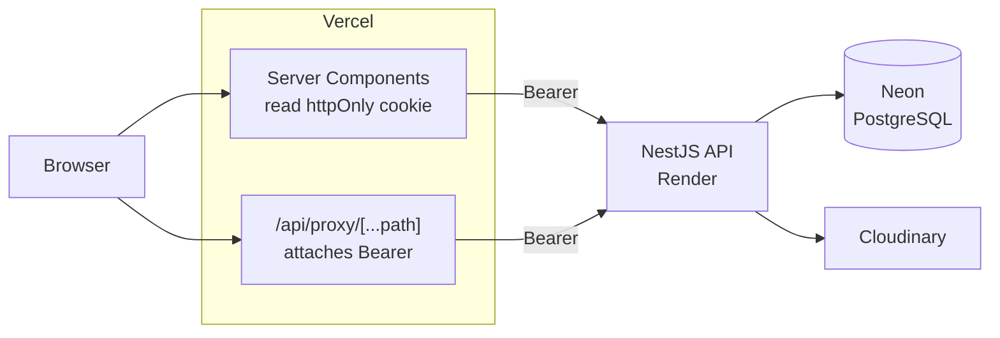

# DEALPORT

Admin dashboard take-home assessment — a real **NestJS + Prisma + PostgreSQL**
API behind a **Next.js 15** admin UI. Three scoped screens (Dashboard, Add
Product, Product List).

## Submission

| | |
|---|---|
| GitHub | https://github.com/lahiru1115/DEALPORT |
| Live frontend | https://dealport-two.vercel.app |
| Live API | https://dealport-api-7aj9.onrender.com |
| API docs (Swagger) | https://dealport-api-7aj9.onrender.com/docs |
| Seed login | `admin@dealport.com` / `Admin@123` |
| Hours spent | ~36 hours |

⚠️ The API runs on Render's free tier, which spins down after ~15 minutes
idle. The first request after a period of inactivity can take up to ~50
seconds to wake it back up — expected, not a bug.

---

## Stack

| Layer | Choice |
|---|---|
| Backend | NestJS 11 · TypeScript · Prisma 6 · PostgreSQL · JWT (passport-jwt + bcrypt) |
| Frontend | Next.js 15 (App Router) · TypeScript · Tailwind CSS v4 · shadcn/ui · TanStack Query · react-hook-form + zod · Recharts |
| Shared | `packages/shared` — zod schemas and types imported by both apps |
| Deploy | Vercel (web) · Render (API) · Neon (PostgreSQL) |
| Extras | Cloudinary (image upload), Swagger (`/docs`) |

---

## Architecture notes



**Auth.** The browser never holds the JWT — it lives in an httpOnly,
`sameSite=lax`, `secure`-in-production cookie. Server Components read it
directly; Client Components go through a same-origin proxy
(`/api/proxy/[...path]`) that attaches the Bearer header server-side, so a
token in `localStorage` (readable by any script, i.e. any XSS) is never in
play, and the API origin is never exposed to the browser.

**Backend layering.** `Controller → Service → Prisma`, no Prisma in
controllers — enforced without exception. Controllers only handle HTTP
shape (routing, DTO binding, status codes); services own business logic and
query construction; `PrismaService` is the only thing that touches the
database. DTOs decorated with `class-validator` are the sole accepted input
shape, under a global `ValidationPipe({ whitelist, forbidNonWhitelisted })`
so unexpected fields are rejected, not silently dropped. A global
`JwtAuthGuard` protects every route by default, opted out per-route with
`@Public()`.

**Shared types.** `packages/shared` holds zod schemas and TypeScript types
used by both apps, so the Add Product form validates against the same
contract the API enforces — a shape mismatch is a compile error, not a
runtime surprise.

---

## Repo layout

```
apps/api/         NestJS — Controller → Service → Prisma, no exceptions
apps/web/         Next.js App Router — RSC dashboard, client Product List/Add Product
packages/shared/  zod schemas + types shared by both apps
design/ docs/     assessment inputs (Figma export, brief PDF), unchanged
```

---

## API

Base URL locally: `http://localhost:4000`. Interactive docs (Swagger, bearer
auth configured) at `/docs` on either environment.

| Method | Path | Auth | Consumed by |
|---|---|:--:|---|
| `POST` | `/auth/login` | 🔓 | Login page |
| `GET` | `/auth/me` | ✅ | App shell user card |
| `GET` | `/products` | ✅ | **Product List** — search + pagination |
| `POST` | `/products` | ✅ | **Add Product** — publish + draft |
| `GET` | `/products/:id` | ✅ | Edit page |
| `PATCH` | `/products/:id` | ✅ | Edit page, status toggle |
| `DELETE` | `/products/:id` | ✅ | Product List row action |
| `GET` | `/products/top` | ✅ | **Dashboard** — Top Products |
| `GET` | `/products/best-selling` | ✅ | **Dashboard** — Best selling |
| `GET` | `/categories` | ✅ | Add Product select, dashboard panel, list filter |
| `GET` | `/tags` | ✅ | Add Product tag select |
| `POST` | `/uploads/image` | ✅ | Add Product image panel (Cloudinary) |
| `GET` | `/dashboard/stats` | ✅ | Dashboard stat cards |
| `GET` | `/dashboard/report` | ✅ | Weekly report card + chart |
| `GET` | `/dashboard/transactions` | ✅ | Transaction table |
| `GET` | `/health` | 🔓 | Uptime/deploy probe |

---

## Local setup

Requires Node 20+ and a local PostgreSQL instance (native, or via the
bundled `docker-compose.yml`).

```bash
npm install

# apps/api/.env — copy from apps/api/.env.example and fill in DATABASE_URL / DIRECT_URL / JWT_SECRET
# apps/web/.env — copy from apps/web/.env.example, defaults work as-is for local dev
cp apps/api/.env.example apps/api/.env
cp apps/web/.env.example apps/web/.env

npm run db:up        # only if using the bundled docker-compose Postgres
npm run db:migrate
npm run db:seed

npm run dev           # runs shared (watch build) + api (:4000) + web (:3000) together
```

Then open `http://localhost:3000` and log in with the seed credentials above.

### Scripts

| Command | What |
|---|---|
| `npm run build` | Production build, all three workspaces in dependency order |
| `npm run lint` | ESLint, api + web |
| `npm test` | Backend unit tests (Jest) |
| `npm run test:e2e` | Backend e2e tests (supertest, hits the real DB) |
| `npm run db:studio` | Prisma Studio against the local DB |
| `npm run db:reset` | Drop, re-migrate, re-seed the local DB |

---

## Environment variables

Neither app's real `.env` is committed — only `.env.example`. No secrets in
the repo.

### `apps/api/.env`

Exact local values are in `apps/api/.env.example` — this just flags what
each var is for and what changes in production.

| Var | Required | Notes |
|---|:--:|---|
| `DATABASE_URL` | ✅ | Local: docker-compose Postgres. Production: Neon **pooled** URL. |
| `DIRECT_URL` | ✅ | Migrations only — Neon **direct** URL in production (pooler doesn't support the advisory locks Prisma Migrate needs) |
| `JWT_SECRET` | ✅ | Any dev string locally; 32+ random bytes in production |
| `JWT_EXPIRES_IN` | — | Defaults to `7d` |
| `PORT` | — | Defaults to `4000`; Render injects its own |
| `CORS_ORIGIN` | ✅ | The Vercel URL in production — pinned, never `*` |
| `CLOUDINARY_CLOUD_NAME` / `_API_KEY` / `_API_SECRET` | optional | Required for uploads in production. Absent locally → `POST /uploads/image` returns `501`, rest of the API still works |
| `NODE_ENV` | — | `development` locally, `production` on deploy |

### `apps/web/.env`

| Var | Required | Notes |
|---|:--:|---|
| `API_URL` | ✅ | Local: `http://localhost:4000`. Production: the Render URL. Server-side only — every browser request goes through the BFF proxy instead. |
| `AUTH_COOKIE_NAME` | — | Defaults to `dealport_token` |
| `NODE_ENV` | — | `development` locally, `production` on deploy — gates the cookie `secure` flag |
